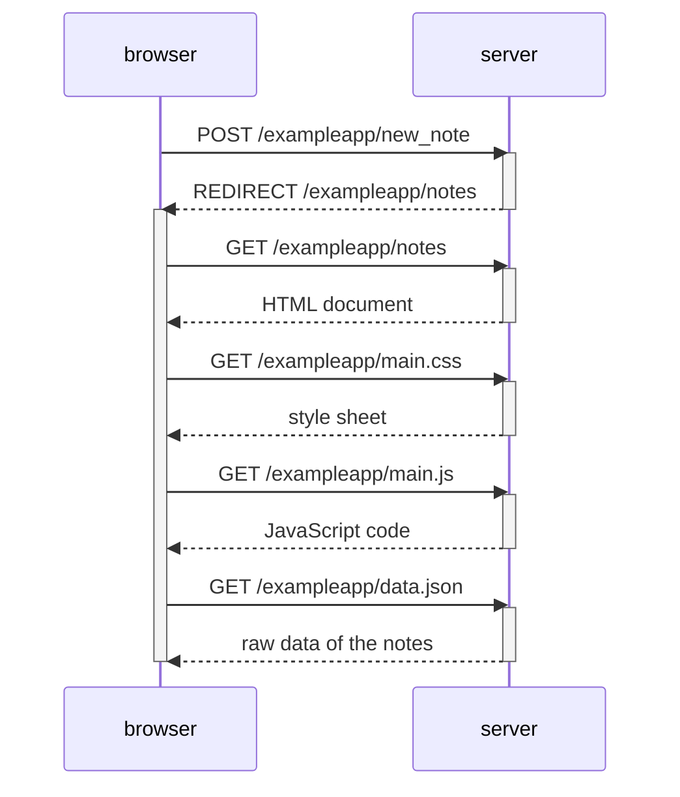

```mermaid
sequenceDiagram
participant browser
participant server
browser->>server: POST /exampleapp/new_note
activate server
server-->>browser: REDIRECT /exampleapp/notes
deactivate server
activate browser
browser->>server: GET /exampleapp/notes
activate server
server-->>browser: HTML document
deactivate server
browser->>server: GET /exampleapp/main.css
activate server
server-->>browser: style sheet
deactivate server
browser->>server: GET /exampleapp/main.js
activate server
server-->>browser: JavaScript code
deactivate server
browser->>server: GET /exampleapp/data.json
activate server
server-->>browser: raw data of the notes
deactivate server
deactivate browser
```
